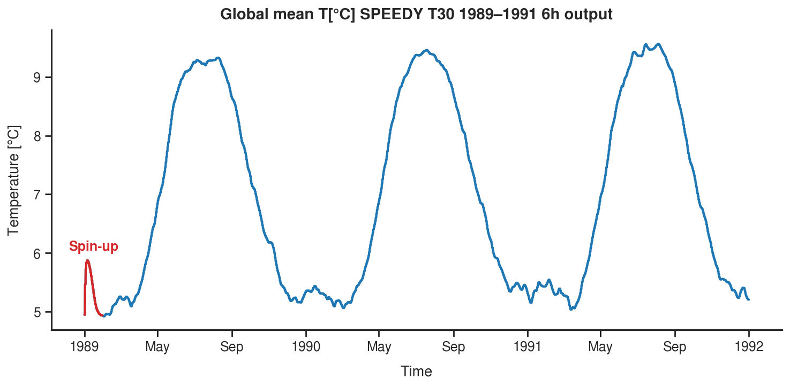

### SPEEDY adjustments and plots

Modifications made to the original SPEEDY configuration for producing atmospheric forcing for ACCESS-OM2.

Current SPEEDY run launched as: `./run_exp.s t30 101 0`

1. time-stepping parameters in ver41.input/cls_instep.h:
```text
NSTOUT = 9 (1 step 40 mins -> 6 hr output) 
IYEAR0 = 1989 (start year) 
NMONTS = 36 (length of integration -> 3 years)
```
2. RYF files produced with `scripts/access_forcing/speedy_forcing_accessom2.ipynb`
3. Forcing fiels for ACCESS-OM2 are currently stored in the `access_forcing` folder

**SPEEDY output check**



