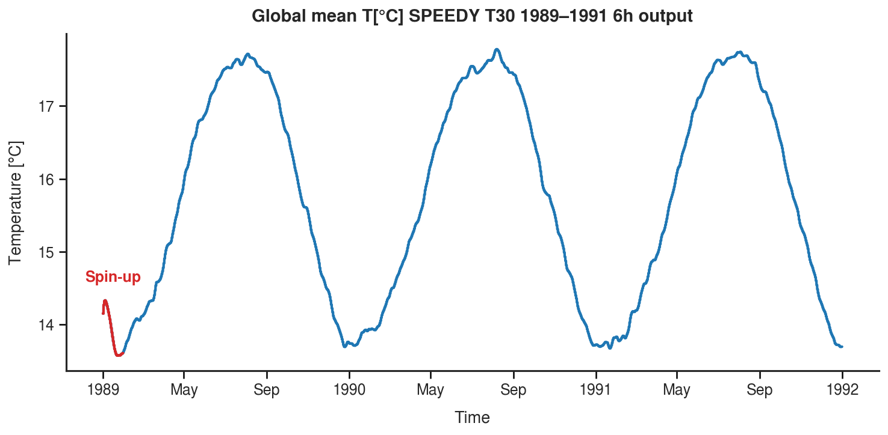
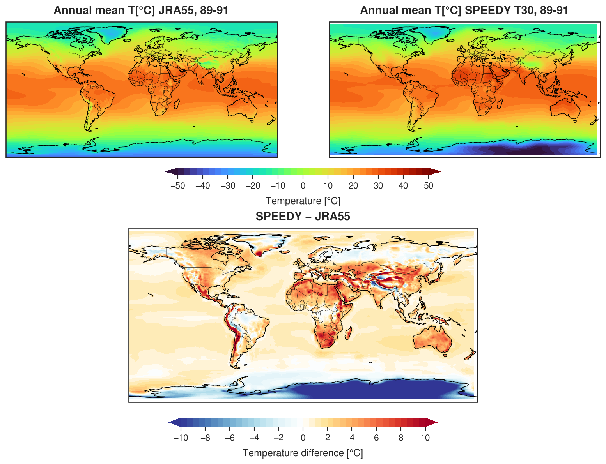
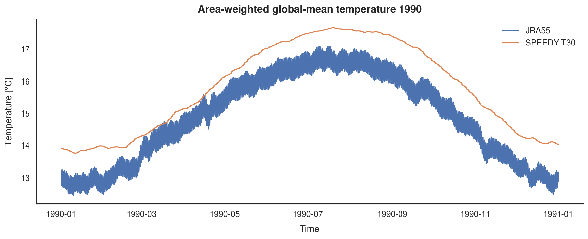
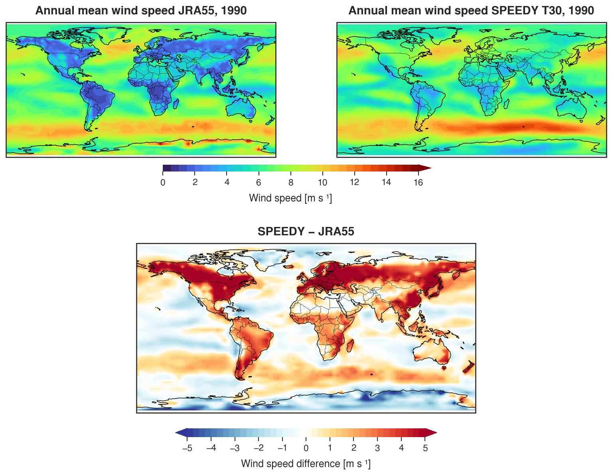
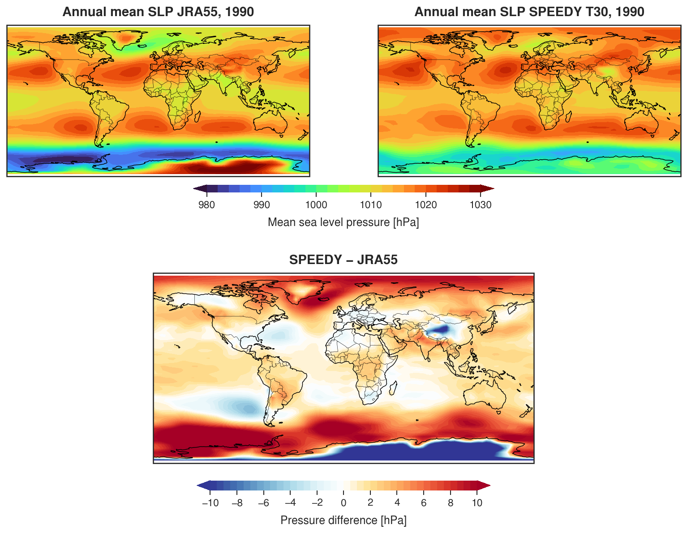

### SPEEDY adjustments and plots

Modifications made to the original SPEEDY configuration for producing atmospheric forcing for ACCESS-OM2.

Current SPEEDY run launched as: `./run_exp.s t30 101 0`
Emacs:
switch between buffers: Ctrl+x b
save: Ctrl+x Ctrl+s
exit: Ctrl+x Ctrl+c

**1.** time-stepping parameters in ver41.input/cls_instep.h:
```text
NSTOUT = 9 (1 step 40 mins -> 6 hr output) 
IYEAR0 = 1989 (start year) 
NMONTS = 36 (length of integration -> 3 years)
```
**2.** RYF files produced with `scripts/access_forcing/speedy_forcing_accessom2.ipynb`
**3.** Forcing fiels for ACCESS-OM2 are currently stored in the `access_forcing` folder

**SPEEDY output check**


**4.** Comparison of JRA55 RYF (May 1990 – May 1991) forcing with SPEEDY

Notebook: `scripts/diagnostics/compare_jra_speedy_forcing_1989.ipynb`

| [°K]  | JRA55 T | SPEEDY Near Surface Air Temp (!) |
|-----------|--------------:|---------------:|
| Mean      | 14.8        | 15.80         |
| Min       | 12.45        | 13.76         |
| Max       | 17.09        | 17.66         |



**5.** Annual cycle T

Notebook: `scripts/diagnostics/compare_jra_speedy_forcing_1989.ipynb`



**6.** Wind



**7.** Sea Level Pressure



**8.** Surface downward radiation output changes
   
Two additional radiation diagnostics were added to the time-mean output for compatibility with ACCESS-OM2 forcing:

- `SSRD` — surface downwelling shortwave radiation → `rsds`
- `SLRD` — surface downwelling longwave radiation → `rlds`

Changes:

- `par_tmean.h`: increased `NS2D_2` from 12 to 14.
- `ppo_dmflux.f`: added `SSRD` and `SLRD` to `SAVE2D_2` as fields 13 and 14.
- `ppo_setctl.f`: added `SSRD` and `SLRD` descriptions to the output `.ctl`.

**9.** Precipitation and snowfall

SPEEDY provides large-scale (`PRECLS`) and convective (`PRECNV`) precipitation: `PREC = PRECLS + PRECNV`

Total snowfall (`SNOW`) was added as a diagnostic in `ppo_dmflux.f`, without modifying the precipitation physics:

`SNOW = PREC` for `TS < 273.15 K`, otherwise `SNOW = 0`.

**10.** SPEEDY does not provide river runoff/routing, so `friver` (and `licalvf`) will remain from JRA55-do for the initial hybrid forcing experiments.


