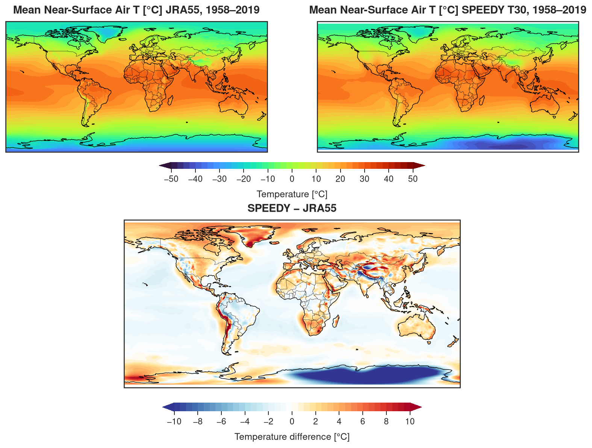
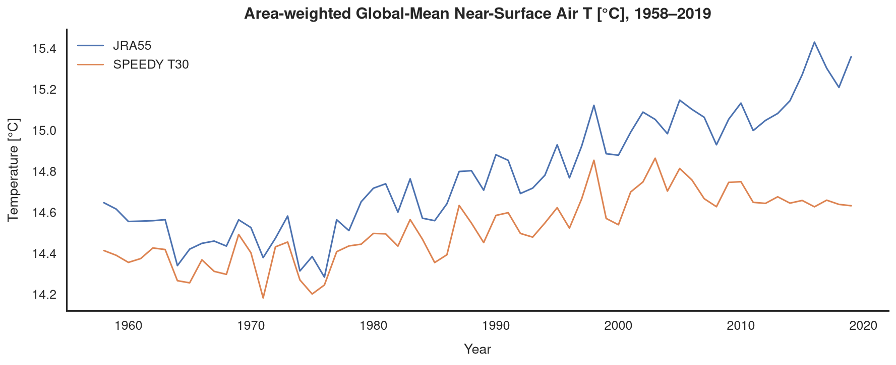
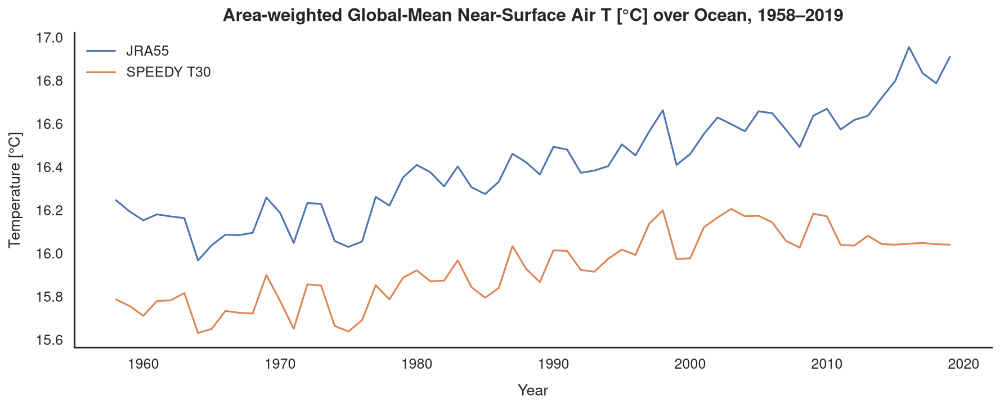
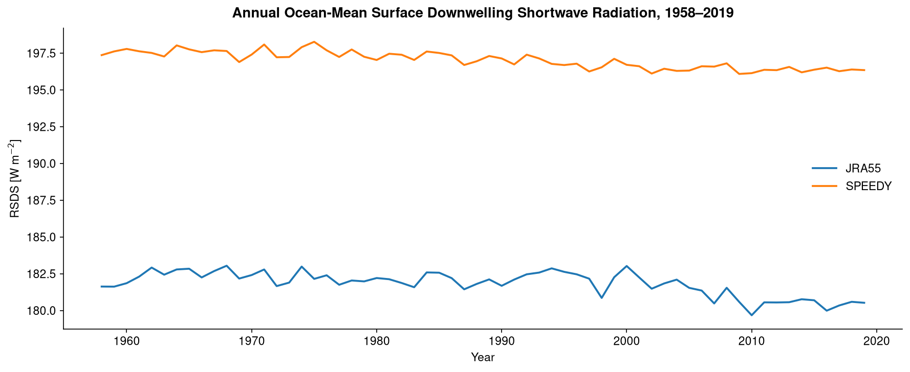
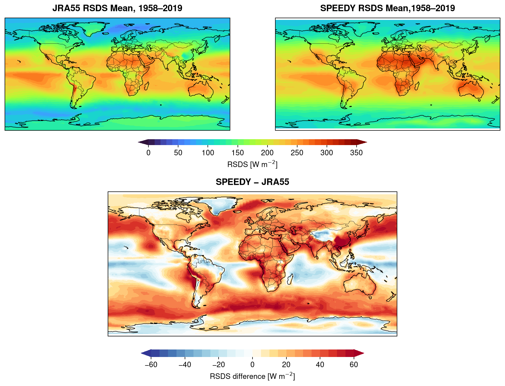
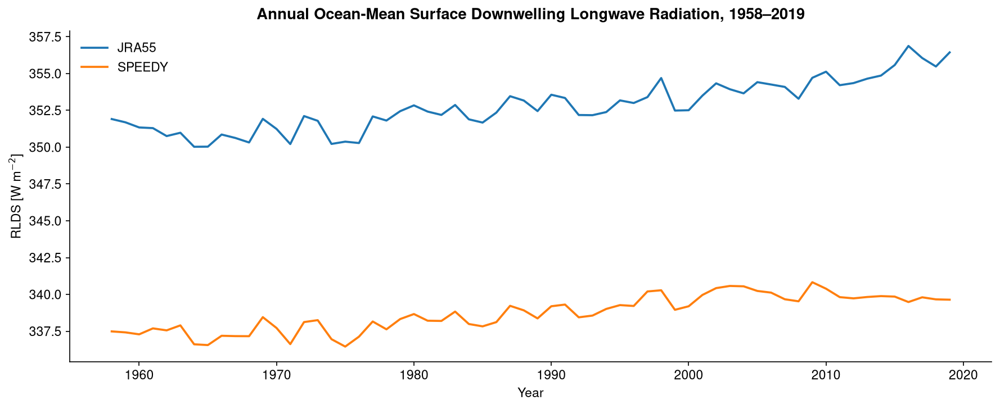
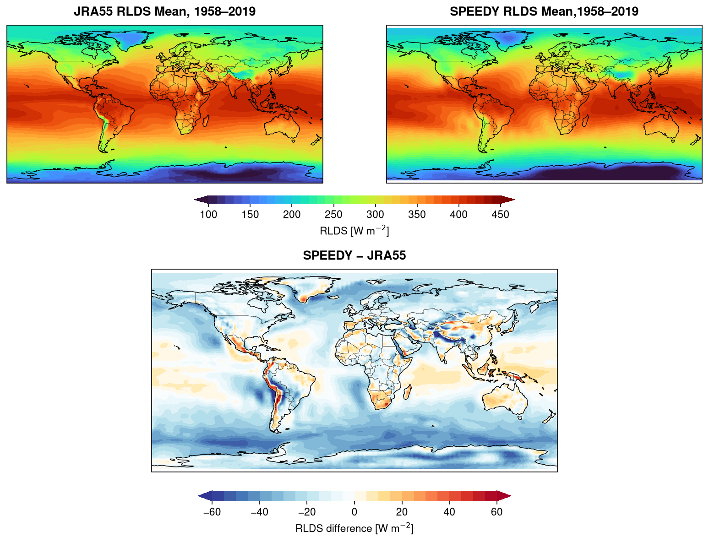
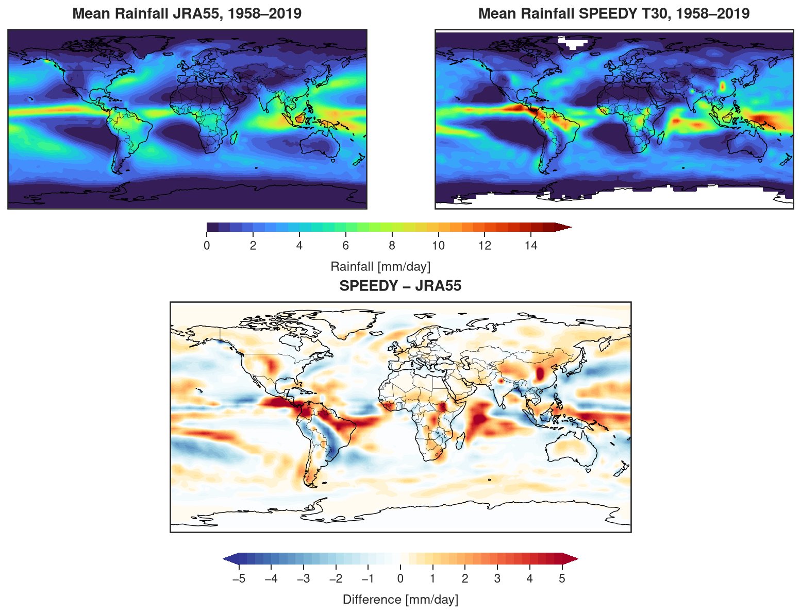
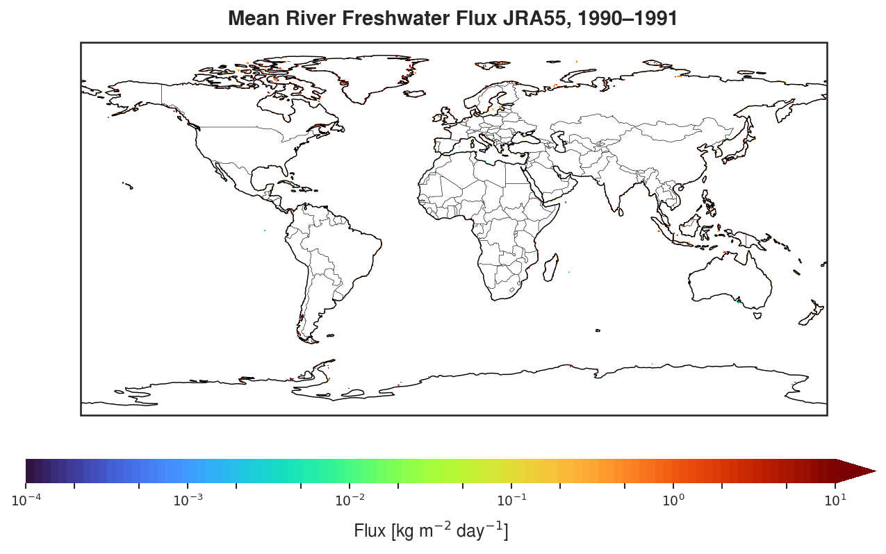
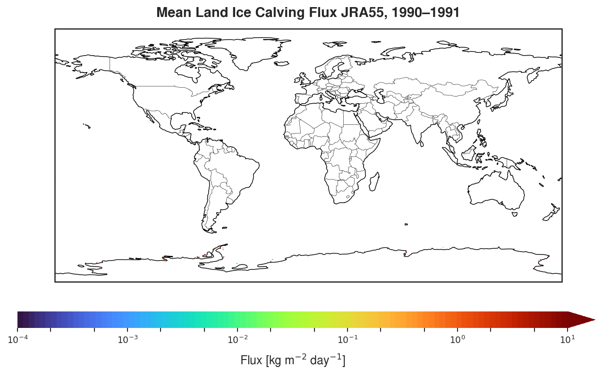

**Radiation** \
Two additional radiation diagnostics were added to the time-mean output for compatibility with ACCESS-OM2 forcing:

- `SSRD` — surface downwelling shortwave radiation → `rsds`
- `SLRD` — surface downwelling longwave radiation → `rlds`

Changes:

- `par_tmean.h`: increased `NS2D_2` from 12 to 14.
- `ppo_dmflux.f`: added `SSRD` and `SLRD` to `SAVE2D_2` as fields 13 and 14.
- `ppo_setctl.f`: added `SSRD` and `SLRD` descriptions to the output `.ctl`.

**Precipitation and Snowfall**

SPEEDY provides large-scale (`PRECLS`) and convective (`PRECNV`) precipitation:

`PREC = PRECLS + PRECNV`

Total snowfall (`SNOW`) was added as a diagnostic in `ppo_dmflux.f`, without modifying the precipitation physics:

`SNOW = PREC` for `TS < 273.15 K`; otherwise `SNOW = 0`.

Total rainfall is then calculated as:

`PREC = PRECLS + PRECNV - SNOW`

## River Runoff and Land-Ice Flux

SPEEDY does not provide river runoff or land-ice freshwater fluxes, so `friver` and `licalvf` remain from JRA55-do for the initial hybrid forcing experiments.

  
  

